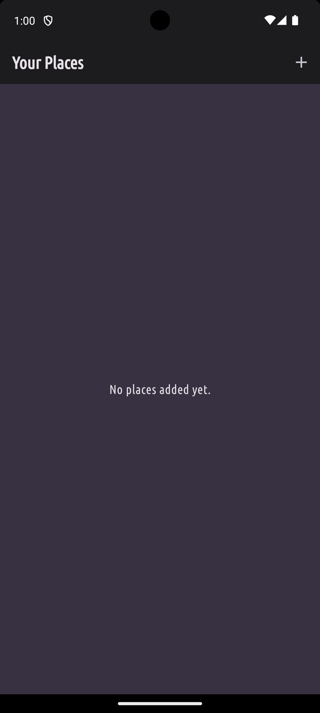
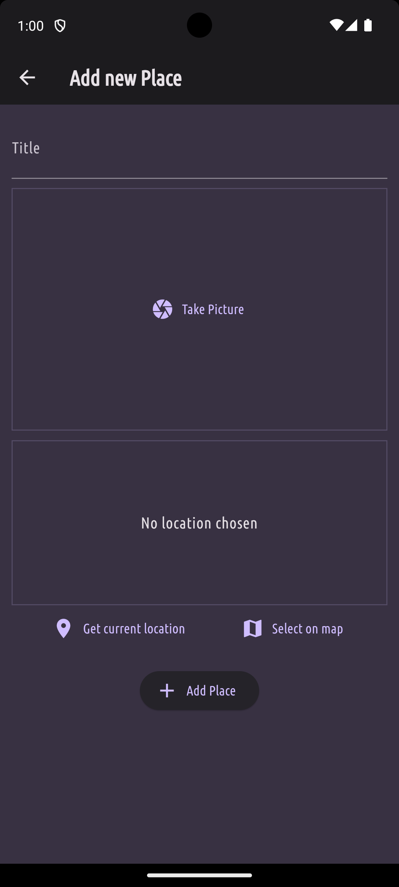
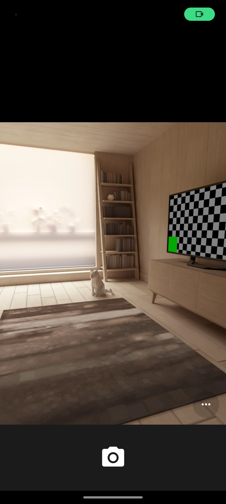
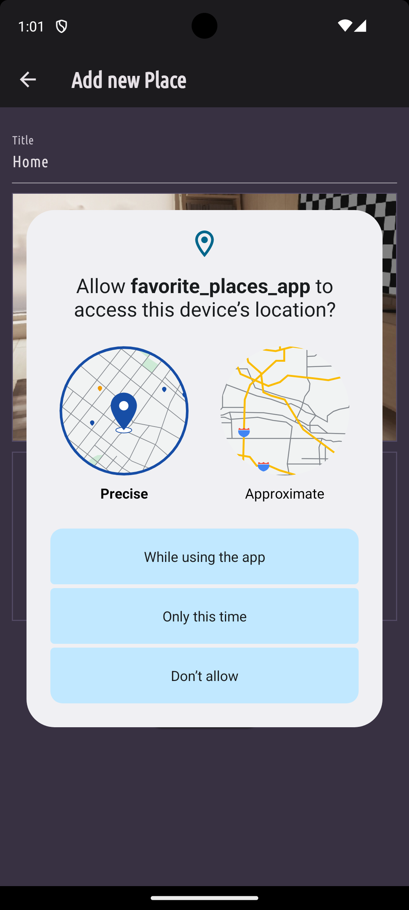
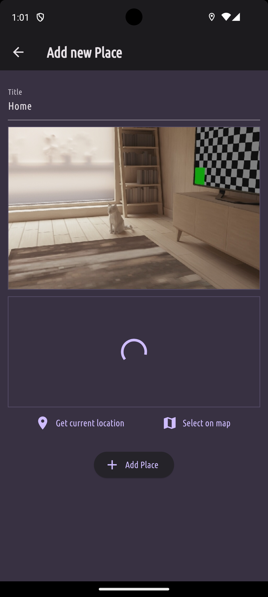
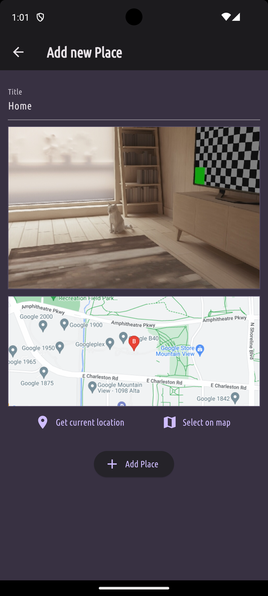

# Favorite Places App

Favorite Places is a Flutter app that allows you to keep track of your favorite locations! Take a picture of a place that is special to you and add it's location either through your current location or mark it on the map. That way you can always revisit those memories through accessing your saved places. This code was produced during the completion of the Flutter course [A Complete Guide to the Flutter SDK & Flutter Framework for building native iOS and Android apps](https://www.udemy.com/course/learn-flutter-dart-to-build-ios-android-apps/learn/lecture/37130436#overview).

## Basic functionality
- List of all your favorite places.
- A place holds a name, a location and an image.
- On a detail screen you see the name, the image and the location.
- Tapping on the image opens the location on the map.
- Create new places for your list by filling out the form.
- Take pictures and save them to the app.
- Save either your current location to a place or pick the location on the map.
- Everything is stored locally so the data is persistent.

### Screenshots 

  
  
  
  
  
  

### Example walkthrough

  

## Topics covered 

- Used the [Image Picker library](https://pub.dev/packages/image_picker) to implement the image picker feature
- Learned how to implement the image picker library on both android and iOS.
- Used the file widget to convert the xFile type pack to a path we can use in our app.
- Used the GestureDetector widget to detect input and gestures on widgets that normally wouldn't be able to do that.
- Used the [location library](https://pub.dev/packages/location) to implement the find user location functionality.
- Learned how to implement the location library on both android and iOS.
- Used the location library documentation to implement the functionality of getting the users location.
- Setup the [Google Maps Api](https://console.cloud.google.com/google/maps-apis/discover) to use it for my location functionalities.
- Used the [Geocoding Api](https://developers.google.com/maps/documentation/geocoding/requests-reverse-geocoding#reverse-example) from google Maps to translate the latitude and longitude to actual locations (Note: Won't work anymore since I had to disable it for money reasons from the google api. You see how it did work with the old key in the screenshots though).
- Used the [Maps Static Api](https://developers.google.com/maps/documentation/maps-static/overview) from google Maps to create a map snapshot based off of the provided user location.
- Used the GoogleMap widget to display data from google maps services.
- Learned about sets being similar to maps. The difference: maps are just a collection of values. It doesn't allow dupilcates.
- Learned about the null operstor ?? in dart.
- Used [Path Provider](https://pub.dev/packages/path_provider) to get access to the path where i should store my images so that they won't get deleted by the OS.
- Used [Path](https://pub.dev/packages/path) to simplify the process of working with file paths. Allows one to construct file paths manually to work on different OS.
- Used [Sqflite](https://pub.dev/packages/sqflite) to be able to store data on the device using SQL commands.
- Used the different functionalities from the three packages above to create a local databse and make the data locally persistent on the device.